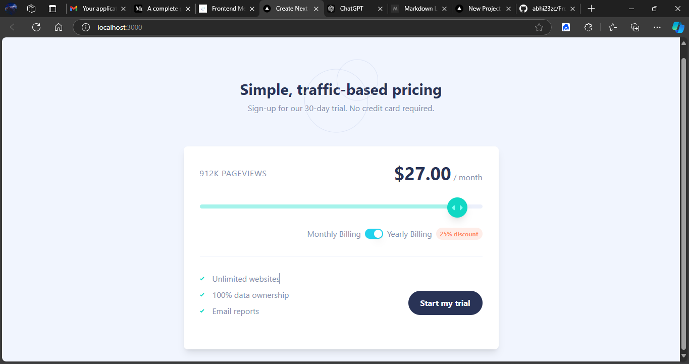

# Frontend Mentor - Interactive Pricing Component Solution

This is a solution to the [Interactive Pricing Component challenge on Frontend Mentor](https://www.frontendmentor.io/challenges/interactive-pricing-component-t0m8PIyY8). Frontend Mentor challenges help you improve your coding skills by building realistic projects.

## Table of Contents

- [Overview](#overview)
  - [The Challenge](#the-challenge)
  - [Screenshot](#screenshot)
  - [Links](#links)
- [My Process](#my-process)
  - [Built With](#built-with)
  - [What I Learned](#what-i-learned)
  - [Continued Development](#continued-development)
  - [Useful Resources](#useful-resources)
- [Author](#author)
- [Acknowledgments](#acknowledgments)

## Overview

### The Challenge

Users should be able to:

- View the optimal layout for the app depending on their device's screen size
- See hover states for all interactive elements on the page
- Use the slider and toggle to see prices for different page view numbers
- Toggle between monthly and yearly billing options with a discount

### Screenshot



### Links

- [Solution URL](#) https://github.com/abhi23zc/Frontend-Mentor-/tree/master
- [Live Site URL](#) https://frontend-mentor-eight-rust.vercel.app/

## My Process

### Built With

- Semantic HTML5 markup
- CSS custom properties
- Flexbox
- Mobile-first workflow
- [React](https://reactjs.org/)
- [Next.js](https://nextjs.org/)
- [Tailwind CSS](https://tailwindcss.com/)
- [shadcn/UI components](https://shadcn.dev/)

### What I Learned

This project allowed me to solidify my knowledge of React, Next.js, and Tailwind CSS. Here are a few key things I learned:

1. Using `useState` and `useEffect` for dynamic pricing and toggling between yearly/monthly billing with a discount.

2. Implementing a custom slider input with interactive styling for smooth transitions.

```js
useEffect(() => {
  let selectedPlan = pricingData[2]; 
  if (pageviews <= 10) selectedPlan = pricingData[0];
  else if (pageviews <= 50) selectedPlan = pricingData[1];
  else if (pageviews <= 100) selectedPlan = pricingData[2];
  else if (pageviews <= 500) selectedPlan = pricingData[3];
  else selectedPlan = pricingData[4];
  
  const basePrice = selectedPlan.price;
  setPrice(isYearly ? basePrice * 0.75 : basePrice);
}, [pageviews, isYearly]);


## Getting Started

First, run the development server:

```bash
npm run dev
# or
yarn dev
# or
pnpm dev
# or
bun dev
```

Open [http://localhost:3000](http://localhost:3000) with your browser to see the result.

You can start editing the page by modifying `app/page.tsx`. The page auto-updates as you edit the file.

This project uses [`next/font`](https://nextjs.org/docs/app/building-your-application/optimizing/fonts) to automatically optimize and load [Geist](https://vercel.com/font), a new font family for Vercel.

## Learn More

To learn more about Next.js, take a look at the following resources:

- [Next.js Documentation](https://nextjs.org/docs) - learn about Next.js features and API.
- [Learn Next.js](https://nextjs.org/learn) - an interactive Next.js tutorial.

You can check out [the Next.js GitHub repository](https://github.com/vercel/next.js) - your feedback and contributions are welcome!

## Deploy on Vercel

The easiest way to deploy your Next.js app is to use the [Vercel Platform](https://vercel.com/new?utm_medium=default-template&filter=next.js&utm_source=create-next-app&utm_campaign=create-next-app-readme) from the creators of Next.js.

Check out our [Next.js deployment documentation](https://nextjs.org/docs/app/building-your-application/deploying) for more details.
